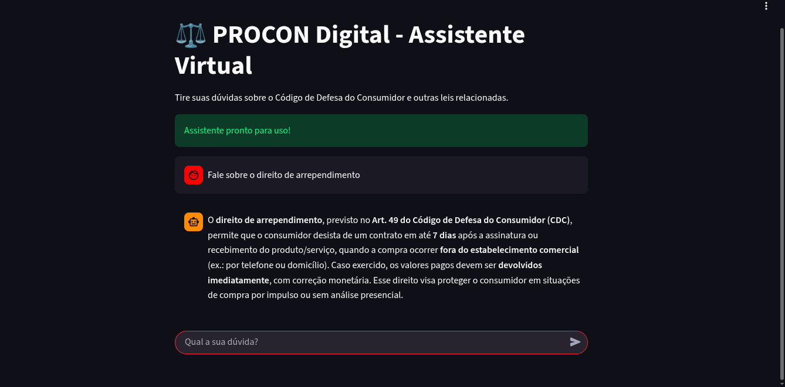

# Assistente de IA para Base de Conhecimento (RAG + Streamlit + GCP)

Este projeto é um assistente de IA (chatbot) que utiliza RAG (Retrieval-Augmented Generation) para responder perguntas com base em uma base de conhecimento de documentos PDF.

Construído com Python, LangChain e Streamlit, e totalmente containerizado com Docker para deploy na Google Cloud Run.

## Screenshots

Aqui está uma demonstração do assistente em ação:

**Interface de Chat (Streamlit):**


**Exemplo de Resposta (Baseada em RAG):**



## Como Funciona

A aplicação segue uma arquitetura RAG clássica:

1.  **Ingestão de Dados:** Ao iniciar, a aplicação carrega os arquivos PDF de uma pasta local, os divide em "chunks" (pedaços) de texto otimizados.
2.  **Criação de Embeddings:** Usando um modelo de embedding (como o da Mistral AI), cada chunk de texto é transformado em um vetor numérico e armazenado em um banco de dados vetorial (ChromaDB).
3.  **Consulta (RAG):**
    * Quando o usuário faz uma pergunta, ela também é transformada em um vetor.
    * O ChromaDB encontra os chunks de texto mais relevantes (semanticamente similares) à pergunta.
    * Esses chunks (o "contexto") e a pergunta original são enviados para um LLM (como o DeepSeek).
4.  **Resposta:** O LLM gera uma resposta baseada *apenas* no contexto fornecido, que é então exibida ao usuário na interface do Streamlit.

## Stack de Tecnologia

* **Backend & Lógica de IA:** Python, LangChain, LangChain-DeepSeek (LLM), LangChain-MistralAI (Embeddings)
* **Banco de Dados Vetorial:** ChromaDB
* **Processamento de Documentos:** PyPDFLoader, RecursiveCharacterTextSplitter
* **Frontend:** Streamlit
* **Deploy:** Docker, Google Cloud Run, Google Artifact Registry, Google Secret Manager

---

## Configuração e Instalação

Existem duas maneiras de rodar este projeto: localmente (para desenvolvimento) ou via Docker (para produção).

### 1. Instalação Local

**Pré-requisitos:**
* Python 3.10+
* Conta na DeepSeek e/ou Mistral AI para as chaves de API (gratuitos)

**Passos:**

1.  **Clone o repositório:**
    ```bash
    git clone [https://github.com/rogpessoa/ChatBot---Assistente-de-IA-para-Base-de-Conhecimento.git](https://github.com/rogpessoa/ChatBot---Assistente-de-IA-para-Base-de-Conhecimento.git)
    cd SEU-REPOSITORIO
    ```

2.  **Crie e ative um ambiente virtual:**
    ```bash
    python -m venv .venv
    source .venv/bin/activate
    ```

3.  **Instale as dependências:**
    ```bash
    pip install -r requirements.txt
    ```

4.  **Adicione seus documentos:**
    Coloque seus arquivos PDF (ex: `documento1.pdf`, `documento2.pdf`) na raiz do projeto. Você precisará atualizar os nomes dos arquivos no código `app.py`.

5.  **Configure suas chaves de API:**
    Crie a pasta e o arquivo de segredos do Streamlit:
    ```bash
    mkdir .streamlit
    nano .streamlit/secrets.toml
    ```
    Adicione suas chaves ao arquivo `secrets.toml`:
    ```toml
    DEEPSEEK_API_KEY = "sk-..."
    MISTRAL_API_KEY = "sk-..."
    ```

6.  **Rode a aplicação:**
    ```bash
    streamlit run app.py
    ```

### 2. Instalação via Docker (Produção)

Este projeto está configurado para ser construído e executado em um container Docker, que é a forma como ele foi feito o deploy na Google Cloud.

1.  **Construa a Imagem Docker:**
    (Certifique-se de que o Docker está em execução)
    ```bash
    docker build -t seu-nome-de-imagem .
    ```

2.  **Rode o Container:**
    Você precisa "montar" seu arquivo de segredos local no container ao executá-lo.

    ```bash
    docker run -d -p 8501:8501 \
        -v $(pwd)/.streamlit/secrets.toml:/app/.streamlit/secrets.toml:ro \
        --name meu-assistente-app \
        seu-nome-de-imagem
    ```

3.  Acesse `http://localhost:8501` no seu navegador.

### Deploy na Google Cloud Run

Os passos para o deploy usando Cloud Run/Cloudbuild
1. Criar um arquivo cloudbuild.yaml com as configurações;
2. Habilitar as APIs do CloudBuild e IAM

```bash
    gcloud services enable cloudbuild.googleapis.com
    gcloud services enable iam.googleapis.com   

```
3. Define seu projectID (será necessário para usar na autenticação do cloudbuild)
```bash
  export PROJECT_ID=$(gcloud config get-value project)
```
4. Encontra o número do projeto onde está vinculado o cloudrun
```bash
    export PROJECT_NUMBER=$(gcloud projects describe $PROJECT_ID --format="value(projectNumber)")
```
5. Cria email do serviço do cloudbuild que será usado na autenticação
```bash
    export CLOUDBUILD_SA="${PROJECT_NUMBER}@cloudbuild.gserviceaccount.com"
```
6. Permissão para implantar no CloudRun
```bash
  gcloud projects add-iam-policy-binding $PROJECT_ID \
      --member="serviceAccount:$CLOUDBUILD_SA" \
      --role="roles/run.admin"
```
6. Permissão para enviar a imagem Docker
```bash
    gcloud projects add-iam-policy-binding $PROJECT_ID \
        --member="serviceAccount:$CLOUDBUILD_SA" \
        --role="roles/artifactregistry.writer"
```
7. Agora precisamos criar uma permissão para Cloud Build "agir como um Robô" do cloud run
```bash
  export RUN_SA=$(gcloud projects describe $PROJECT_ID --format="value(projectNumber)")-compute@developer.gserviceaccount.com
  gcloud iam service-accounts add-iam-policy-binding $RUN_SA \
    --member="serviceAccount:$CLOUDBUILD_SA" \
    --role="roles/iam.serviceAccountUser"
```
8. Criar um arquivo cloudbuild.yaml (no repositorio tem)
9. No console do GCP ir em Cloud Build, procurar por gatilhos (triggers) e conectar no repositório
10. Ainda no painel do gatilho, é necessário configurar o deploy deixando por padrão envio por push ou ramificação e clicar em criar

# Próximo passo para o DEPLOY
1. Modificar os arquivos do projeto e realizar o commit normalmente para o github.
2. Em alguns minutos sua atualização deverá ser atualizada no cloud run.

## Observações
1. Caso apresente algum erro no próprio Github apresenta
2. No Cloud build também ficam os logs do docker
